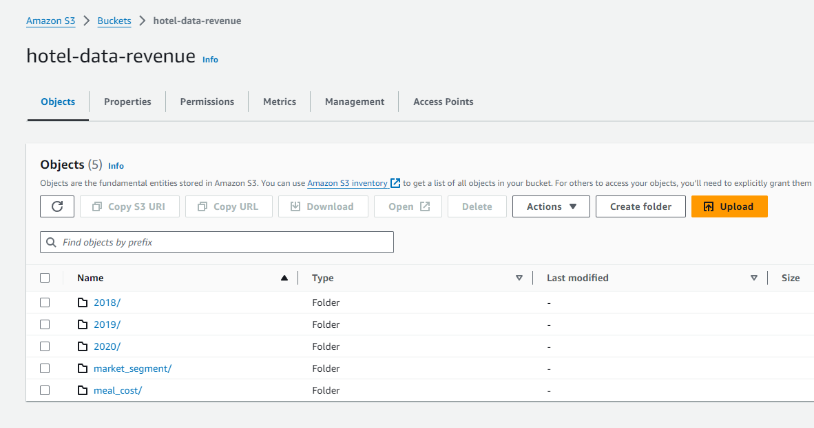
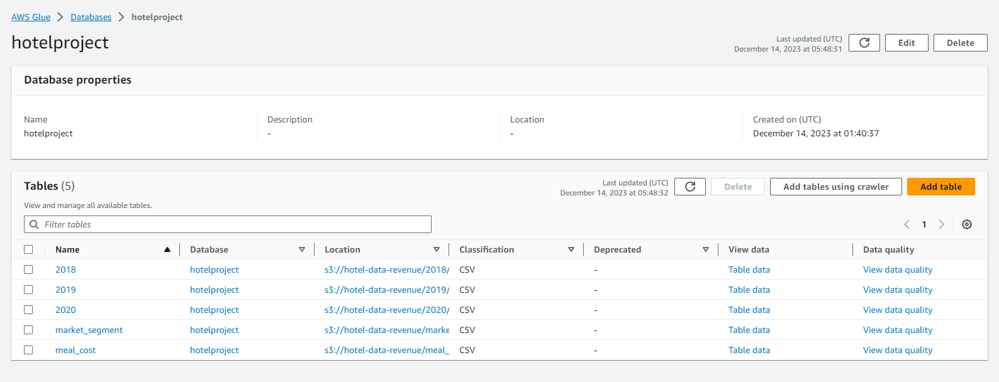
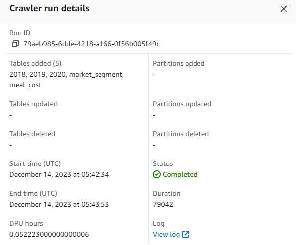
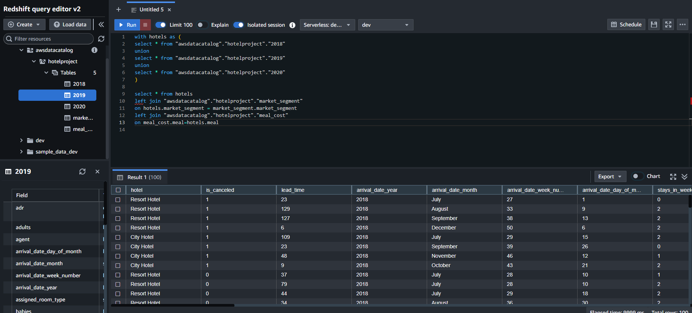

# Hotel Data Analysis

### Introduction to Data

The goal of the project is to take Hotel Data across several excel worksheets and create an interactive dashboard that our end user can access.

### Building a Database

#### Local Implementation

Originally, the project was done locally by building the database through SQL Server Microsoft Studio. Then, I connected PowerBI to my local server and created the interactive dashboard.

#### AWS Cloud Implementation

However, in the current day it is important to be able to implement your Data Science skills within the Cloud. 

##### Steps

1. I uploaded all the required tables to a bucket on AWS S3.

2. Next, I built the Database with AWS Glue. Utilizing the Glue Crawler AWS Service, I copied the data from the S3 Bucket into the tables of the Glue database.

3. Finally, I utilized AWS Redshift to query my data. Then, I connected PowerBI to my AWS Redshift Server and recreated the same PowerBI dashboard.

   
